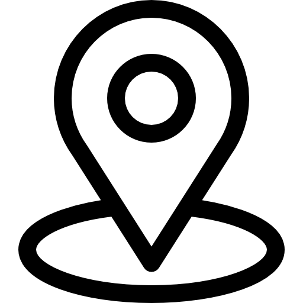

# Personal-Portfolio
My personal Portfolio

css
.header {
    display: grid;
    grid-template-columns: 80px 80px 80px 80px;
    gap: 20px;
    align-items: center;

    background: rgba(255, 255, 255, 0.25);
    backdrop-filter: blur(12px);
    -webkit-backdrop-filter: blur(12px);
    border-radius: 16px;
    border: 1px solid rgba(255, 255, 255, 0.4);
    box-shadow: 0 8px 32px rgba(0, 0, 0, 0.15);
    padding: 10px;
}

.pfp-grid {
    display: grid;
    max-width: 900px;
    align-items: start;
    font-family: Arial, Helvetica, sans-serif;
}

.pfp {
    height: 170px;
    width: 170px;
    border-radius: 10px;
    margin-left: 50px;
    margin-top: 30px;
    position: absolute;
}

.info {
    margin-left: 240px;
    margin-top: 52px;
    margin-bottom: 3px;
}

.info-emoji {
    vertical-align: middle;
    margin-bottom: 3px;
    width: 19px;
    height: 19px;
    color: blue;
    
}

.loc-grid {
    display: grid;
    align-items: center;
    grid-template-columns: 10px 1fr;
}

.loc {
    margin-left: 247px;
    margin-top: 0px;
    font-size: 12px;
    font-family: 'Trebuchet MS', 'Lucida Sans Unicode', 'Lucida Grande', 'Lucida Sans', Arial, sans-serif;
}

.loc-emoji {
    height: 13px;
    width: 13px;
    margin-left: 240px;
    margin-top: -10px;
}

.degree {
    margin-left: 240px;
    font-family: Arial, Helvetica, sans-serif;
    font-size: 13px;
}

.email {
    margin-left: 240px;
    padding-top: 9px;
    padding-bottom: 9px;
    font-family: Arial, Helvetica, sans-serif;
    font-weight: bold;
    align-items: center;
    display: flex;
    justify-content: center;
    cursor: pointer;
    background: rgba(255, 255, 255, 0.25);
    backdrop-filter: blur(12px);
    -webkit-backdrop-filter: blur(12px);
    border-radius: 16px;
    border: 1px solid rgba(255, 255, 255, 0.4);
    box-shadow: 0 8px 32px rgba(0, 0, 0, 0.15);
    padding: 10px;
}

.email-emoji {
    height: 16px;
    width: 16px;
    max-width: 200px;
    margin-right: 7px;
}

.questions {
    margin-left: 5px;
    font-family: Arial, Helvetica, sans-serif;
    font-weight: bold;
    color: hsl(0, 0%, 0%);
    background-color: hsl(0, 0%, 0%);
    max-width: 200px;
    align-items: center;
    display: flex;
    justify-content: center;
    cursor: pointer;

    background: rgba(0, 0, 0, 0.25);
    backdrop-filter: blur(12px);
    -webkit-backdrop-filter: blur(20px);
    border-radius: 16px;
    border: 1px solid rgba(255, 255, 255, 0.4);
    box-shadow: 0 8px 32px rgba(0, 0, 0, 0.15);
    padding: 10px;
}

.questions-emoji {
    height: 13px;
    width: 13px;
    margin-right: 7px;
}

.button-grid {
  display: grid;  
  grid-template-columns: 370px 150px;
}

.about-card {
    margin-top: 30px;
    margin-left: 50px;
    max-width: 900px;
    border: 2px;
    border-style: solid;
    border-color: rgb(255, 255, 255);
    background: rgba(255, 255, 255, 0.25);
    backdrop-filter: blur(12px);
    -webkit-backdrop-filter: blur(12px);
    border-radius: 16px;
    border: 1px solid rgba(255, 255, 255, 0.4);
    box-shadow: 0 8px 32px rgba(0, 0, 0, 0.15);
    padding: 20px;
    border-radius: 10px;
    padding-left: 20px;
    padding-right: 30px;
    padding-bottom: 20px;
    line-height: 30px;
    font-size: 17px;
    font-family:system-ui, -apple-system, BlinkMacSystemFont, 'Segoe UI', Roboto, Oxygen, Ubuntu, Cantarell, 'Open Sans', 'Helvetica Neue', sans-serif;
}

.about {
    font-family: 'Times New Roman', Times, serif;
    justify-content: center;
    align-items: center;
}

.experiences {
    margin-top: 30px;
    max-width: 450px;
    border: 2px;
    border-radius: 5px;
    border-style: solid;
    background: rgba(255, 255, 255, 0.25);
    backdrop-filter: blur(12px);
    -webkit-backdrop-filter: blur(12px);
    border-radius: 16px;
    border: 1px solid rgba(255, 255, 255, 0.4);
    box-shadow: 0 8px 32px rgba(0, 0, 0, 0.15);
    padding: 20px;
    padding-left: 20px;
    padding-right: 20px;
    line-height: 30px;
    font-size: 15px;
    min-height: 950px;
}

.stack {
    margin-left: 50px;
    margin-bottom: 2px;
    max-width: 900px;
    border: 2px;
    border-style: solid;
    border-color: lightgray;
    border-radius: 5px;
    padding-left: 20px;
    padding-right: 20px;
    line-height: 30px;
    font-size: 15px;
    min-height: 600px;
}

.stack-emoji {
    vertical-align: text-top;
    margin-right: 3px;
    width: 26px;
    height: 26px;
}

.frontend-emoji {
    vertical-align: middle;
    margin-bottom: 4px;
    width: 24px;
    height: 24px;
}

.html {
    font-family:system-ui, -apple-system, BlinkMacSystemFont, 'Segoe UI', Roboto, Oxygen, Ubuntu, Cantarell, 'Open Sans', 'Helvetica Neue', sans-serif;
    font-weight: bold;
    min-width: 100px;
    min-height: 45px;
    border-radius: 30px;
    cursor: pointer;
}

.html-emoji {
    vertical-align: middle;
    margin-right: -1px;
    margin-bottom: 3px;
    width: 20px;
    height: 20px;
}

.css {
    font-family:system-ui, -apple-system, BlinkMacSystemFont, 'Segoe UI', Roboto, Oxygen, Ubuntu, Cantarell, 'Open Sans', 'Helvetica Neue', sans-serif;
    font-weight: bold;
    min-width: 100px;
    min-height: 45px;
    border-radius: 30px;
    cursor: pointer;
}

.css-emoji {
    vertical-align: middle;
    margin-right: -1px;
    margin-bottom: 3px;
    width: 20px;
    height: 20px;
}

.javascript {
    font-family:system-ui, -apple-system, BlinkMacSystemFont, 'Segoe UI', Roboto, Oxygen, Ubuntu, Cantarell, 'Open Sans', 'Helvetica Neue', sans-serif;
    font-weight: bold;
    min-width: 130px;
    min-height: 45px;
    border-radius: 30px;
    cursor: pointer;
}

.js-emoji {
    vertical-align: middle;
    margin-right: -1px;
    margin-bottom: 3px;
    width: 20px;
    height: 20px;
}

.react {
    font-family:system-ui, -apple-system, BlinkMacSystemFont, 'Segoe UI', Roboto, Oxygen, Ubuntu, Cantarell, 'Open Sans', 'Helvetica Neue', sans-serif;
    font-weight: bold;
    min-width: 100px;
    min-height: 45px;
    border-radius: 30px;
    cursor: pointer;
}

.react-emoji {
    vertical-align: middle;
    margin-right: -1px;
    margin-bottom: 3px;
    width: 20px;
    height: 20px;
}

.tailwind {
    font-family:system-ui, -apple-system, BlinkMacSystemFont, 'Segoe UI', Roboto, Oxygen, Ubuntu, Cantarell, 'Open Sans', 'Helvetica Neue', sans-serif;
    font-weight: bold;
    min-width: 135px;
    min-height: 45px;
    border-radius: 30px;
    cursor: pointer;
}

.tailwind-emoji {
    vertical-align: middle;
    margin-right: -1px;
    margin-bottom: 3px;
    width: 20px;
    height: 20px;
}

.frontend-list {
    display: flex;
    gap: 15px;
    align-items: start;
}

.about-section {
  display: grid;
  grid-template-columns: 940px 1fr;
  grid-template-rows: 340px 700px 600px;
  align-items: start;
  row-gap: 40px;
  column-gap: 10px;
}

index
<!DOCTYPE html>
<html lang="en">
<head>
  <meta charset="UTF-8">
  <meta name="viewport" content="width=device-width, initial-scale=1.0">
  <title>Personal Portfolio</title>
  <link rel="stylesheet" href="style.css">
</head>
<body>

  

    <button class="header-home">
      Home
    </button>

    <button class="header-about">
      About
    </button>

    <button class="header-projects">
      Projects
    </button>

    <button class="header-gallers">
      Gallery
    </button>
  

  
 
    
    <h2 class="info"> 
      James Gabriel B. Boo
      
    </h2>
    

      
      
 National Capital Region, Philippines 
 
    

    <h3 class="degree">BSCSSE / Aspiring Full Stack Developer</h3>

    

      <button class="email">
         
        Send Email
      </button>
        
      <button class="questions">
         
        Ask Questions
      </button>

      

  

  <section class="about-section">
    

      

<<<<<<< HEAD
        <h2>
          About me
=======
        <h2>
          About
>>>>>>> 6c0b984068d6fa181f6b660c01912da34b8ab609
        </h2>
      

      

        I am currently a second-year Computer Science student at Far Eastern University 
        Institute of Technology, specializing in Software Engineering. I have built a strong 
        foundation in programming, data structures, algorithms, database management, and core software 
        development principles.
      

      
      

        As an aspiring Full Stack Developer, I am passionate about building efficient, 
        scalable, and user-friendly applications. I enjoy working on both front-end and 
        back-end development, creating intuitive interfaces and robust server-side systems. 
        My goal is to become a well-rounded software engineer who writes clean, maintainable 
        code and continuously adapts to emerging technologies.
      

    

    

<<<<<<< HEAD
      <h2>
        Achievements and   Certificates
=======
      <h2> 
        Experiences
>>>>>>> 6c0b984068d6fa181f6b660c01912da34b8ab609
      </h2>
    

    
  </section>
 
  
</body>
</html>
